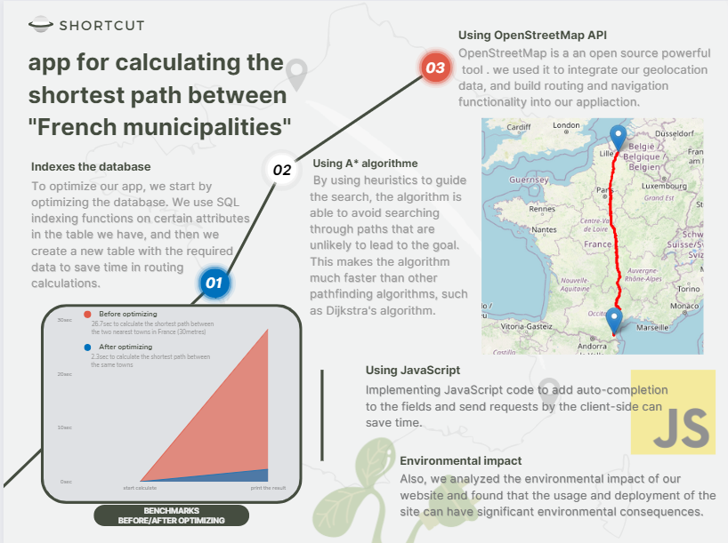
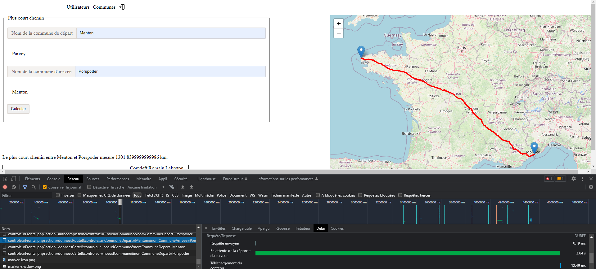

# Plus court chemin - code de base

Plus d'informations sur la page http://romainlebreton.github.io/R.4.01-DeveloppementWeb-JavaScript/

pour l'installation de la bdd voici un lien vers notre tuto : https://docs.google.com/document/d/1EjveVzfZm3c5Iujb7jK-14ByLefK78kddWSwpx5xPwc/edit?usp=sharing

pour voir le rapport du projet :
https://docs.google.com/document/d/1bhSUTj0vhN6-LHDsxt1Woa84gXwVufmCaG7j79AL6mY/edit?usp=sharing

